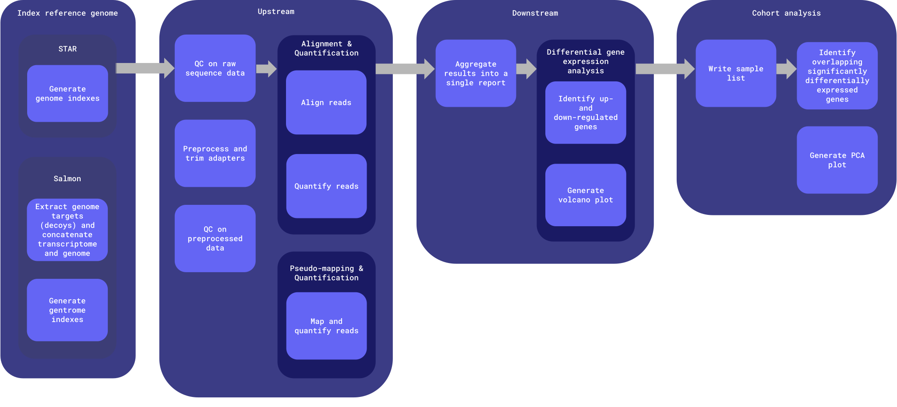

# pmdbs-bulk-rnaseq-wf
Repo for testing and developing a common postmortem-derived brain sequencing (PMDBS) workflow harmonized across ASAP with human bulk RNA sequencing data.


# Table of contents

- [Workflows](#workflows)
- [Inputs](#inputs)
- [Outputs](#outputs)
    - [Output structure](#output-structure)
- [Docker images](#docker-images)


# Workflows

Worfklows are defined in [the `workflows` directory](workflows).

This workflow is set up to analyze bulk RNAseq in WDL using mainly command line and a Python script.



**Entrypoint**: [workflows/main.wdl](workflows/main.wdl)

**Input template**: [workflows/inputs.json](workflows/inputs.json)

The workflow is broken up into four main chunks:

1. [Index reference genome](#index-reference-genome)
2. [Upstream](#upstream)
3. [Downstream](#downstream)
4. [Cohort analysis](#cohort-analysis)

## Index reference genome

Optional step to index reference genome in order to produce a genome directory input for STAR and/or Salmon.

## Upstream

Run once per sample; only rerun when the upstream workflow version is updated. Upstream outputs are stored in the originating team's raw and staging data buckets.

## Downstream

Run once per team (all samples from a single team). This can be rerun using different sample subsets; including additional samples requires this entire analysis to be rerun. Intermediate files from previous runs are not reused and are stored in timestamped directories.

## Cohort analysis
Run once per team (all samples from a single team) if `project.run_project_cohort_analysis` is set to `true`, and once for the whole cohort (all samples from all teams) if `run_cross_team_cohort_analysis` is set to `true`. This can be rerun using different sample subsets; including additional samples requires this entire analysis to be rerun. Intermediate files from previous runs are not reused and are stored in timestamped directories.


# Inputs

An input template file can be found at [workflows/inputs.json](workflows/inputs.json).

| Type | Name | Description |
| :- | :- | :- |
| String | cohort_id | Name of the cohort; used to name output files during cross-team downstream analysis. |
| Array[[Project](#project)] | projects | The project ID, set of samples and their associated reads and metadata, output bucket locations, and whether or not to run project-level downstream analysis. |
| Boolean? | run_alignment_quantification | Option to align raw reads with STAR and quantify aligned reads with Salmon. This and/or 'run_pseudo_mapping_quantification' must be set to true. [true] |
| Boolean? | run_star_index_ref_genome | Option to index reference genome with STAR. If set to false, star_genome_dir_tar_gz must be provided. [false] |
| File? | star_genome_dir_tar_gz | The indexed reference genome files required for STAR. |
| Boolean? | run_pseudo_mapping_quantification | Option to map and directly quantify raw reads with Salmon. This and/or 'run_alignment_quantification' must be set to true. [false] |
| Boolean? | run_salmon_index_ref_genome | Option to create decoy sequences (from genome), concatenating transcriptome and genome, and index concatenated genome with Salmon. If set to false, salmon_genome_dir_tar_gz must be provided [false] |
| File? | salmon_genome_dir_tar_gz | The indexed concatenated transcriptome and genome files required for Salmon. |
| Boolean? | run_cross_team_cohort_analysis | Whether to run downstream harmonization steps on all samples across projects. If set to false, only upstream steps (QC, align/map, and quantify) will run for samples. [false] |
| String | cohort_raw_data_bucket | Bucket to upload cross-team downstream intermediate files to. |
| Array[String] | cohort_staging_data_buckets | Buckets to upload cross-team downstream analysis outputs to. |
| File | metadata_csv | CSV containing all sample information including batch, condition, etc. |
| File | gene_map_csv | CSV containing mapped transcript IDs and gene IDs that must be in this order. |
| File | blacklist_genes_bed | BED file containing the ENCODE Blacklist genes. |
| File | gene_ids_and_names_json | JSON file containing mapped gene IDs and gene names created from the gene annotation GTF. |
| String | container_registry | Container registry where workflow Docker images are hosted. |
| String? | zones | Space-delimited set of GCP zones where compute will take place. ['us-central1-c us-central1-f'] |

## Structs

### Project

| Type | Name | Description |
| :- | :- | :- |
| String | project_id | Unique identifier for project; used for naming output files. |
| Array[[Sample](#sample)] | samples | The set of samples associated with this project. |
| Boolean | run_project_cohort_analysis | Whether or not to run cohort analysis within the project. |
| String | raw_data_bucket | Raw data bucket; intermediate output files that are not final workflow outputs are stored here. |
| String | staging_data_bucket | Staging data bucket; final project-level outputs are stored here. |

### Sample

| Type | Name | Description |
| :- | :- | :- |
| String | sample_id | Unique identifier for the sample within the project. |
| String? | batch | The sample's batch. |
| File | fastq_R1 | Path to the sample's read 1 FASTQ file. |
| File | fastq_R2 | Path to the sample's read 2 FASTQ file. |
| File? | fastq_I1 | Optional fastq index 1. |
| File? | fastq_I2 | Optional fastq index 2. |

### Reference

See [reference data](#reference-data) notes for more details.

| Type | Name | Description |
| :- | :- | :- |
| File | primary_assembly_fasta | Nucleotide sequence of the GRCh38 primary genome assembly (chromosomes and scaffolds). |
| File | gene_annotation_gtf | Comprehensive gene annotation on the reference chromosomes only. |
| File | transcripts_fasta | Nucleotide sequences of all transcripts on the reference chromosomes. |
| File | all_transcripts_fasta | Manually generated all transcripts on the reference chromosomes with the `primary_assembly_fasta` and `gene_annotation_gtf`. |

## Generating the inputs JSON

The inputs JSON may be generated manually, however when running a large number of samples, this can become unwieldly. The `generate_inputs` utility script may be used to automatically generate the inputs JSON. The script requires the libraries outlined in [the requirements.txt file](util/requirements.txt) and the following inputs:

- `project-tsv`: One or more project TSVs with one row per sample and columns project_id, sample_id, batch, fastq_path. All samples from all projects may be included in the same project TSV, or multiple project TSVs may be provided.
    - `project_id`: A unique identifier for the project from which the sample(s) arose
    - `sample_id`: A unique identifier for the sample within the project
    - `batch`: The sample's batch
    - `fastq_path`: The directory in which paired sample FASTQs may be found, including the gs:// bucket name and path
- `fastq-locs-txt`: FASTQ locations for all samples provided in the `project-tsv`, one per line. Each sample is expected to have one set of paired fastqs located at `${fastq_path}/${sample_id}*`. The read 1 file should include 'R1' somewhere in the filename; the read 2 file should inclue 'R2' somewhere in the filename. Generate this file e.g. by running `gsutil ls gs://fastq_bucket/some/path/**.fastq.gz >> fastq_locs.txt`
- `inputs-template`: The inputs template JSON file into which the `projects` information derived from the `project-tsv` will be inserted. Must have a key ending in `*.projects`. Other default values filled out in the inputs template will be written to the output inputs.json file.
- `run-project-cohort-analysis`: Optionally run project-level cohort analysis for provided projects. This value will apply to all projcets. [false]
- `output-file`: Optional output file name. [inputs.json]

Example usage:

```bash
./util/generate_inputs \
    --project-tsv sample_info.tsv \
    --fastq-locs-txt fastq_locs.txt \
    --inputs-template workflows/inputs.json \
    --run-project-cohort-analysis \
    --output-file harmony_workflow_inputs.json
```

# Outputs

## Output structure

- `cohort_id`: either the `project_id` for project-level downstream analysis, or the `cohort_id` for the full cohort
- `workflow_run_timestamp`: format: `%Y-%m-%dT%H-%M-%SZ`
- The list of samples used to generate the downstream analysis will be output alongside other downstream analysis outputs in the staging data bucket (`${cohort_id}.sample_list.tsv`)
- The MANIFEST.tsv file in the staging data bucket describes the file name, md5 hash, timestamp, workflow version, workflow name, and workflow release for the run used to generate each file in that directory

### Raw data (intermediate files and final outputs for all runs of the workflow)

The raw data bucket will contain *some* artifacts generated as part of workflow execution. Following successful workflow execution, the artifacts will also be copied into the staging bucket as final outputs.

In the workflow, task outputs are either specified as `String` (final outputs, which will be copied in order to live in raw data buckets and staging buckets) or `File` (intermediate outputs that are periodically cleaned up, which will live in the cromwell-output bucket). This was implemented to reduce storage costs. Upstream final outputs are defined in the workflow at [main.wdl](workflows/main.wdl#L85-L116), downstream analysis final outputs are defined at [downstream.wdl](workflows/main.wdl#L182-200), and cohort analysis final outputs are defined at [cohort_analysis.wdl](workflows/cohort_analysis/cohort_analysis.wdl#L85-93).

```bash
asap-raw-data-{cohort,team-xxyy}
└── workflow_execution
	├── cohort_analysis
	│	└──${cohort_analysis_workflow_version}
	│		└── ${salmon_mode}
	│			└── ${workflow_run_timestamp}
	│				└── <cohort_analysis outputs>
	├── downstream // only produced in project raw data buckets, not in the full cohort bucket
	│	└──${downstream_workflow_version}
	│		└── ${salmon_mode}
	│			└── ${workflow_run_timestamp}
	│				└── <downstream outputs>
	└── upstream  // only produced in project raw data buckets, not in the full cohort bucket
		├── fastqc_raw_reads
		│	└── ${upstream_workflow_version}
		│		└── <fastqc_raw_reads output>
		├── trim_and_qc
		│	└── ${upstream_workflow_version}
		│		└── <trim_and_qc output>
		├── fastqc_trimmed_reads
		│	└── ${upstream_workflow_version}
		│		└── <fastqc_trimmed_reads output>
		├── alignment_quantification
		│	└── ${alignment_quantification_workflow_version}
		│		└── <alignment_quantification output>
		└── pseudo_mapping_quantification
			└── ${pseudo_mapping_quantification_workflow_version}
				└── <pseudo_mapping_quantification output>
```

### Staging data (intermediate workflow objects and final workflow outputs for the latest run of the workflow)

Following QC by researchers, the objects in the dev or uat bucket are synced into the curated data buckets, maintaining the same file structure. Curated data buckets are named `asap-curated-{collection}-{modality}-{cohort,team-xxyy}`.

Data may be synced using [the `promote_staging_data` script](#promoting-staging-data).

```bash
asap-dev-{collection}-{modality}-{cohort,team-xxyy}
├── cohort_analysis
│   ├── ${cohort_id}.sample_list.tsv
│	├──	${cohort_id}.${salmon_mode}.overlapping_significant_genes.csv # File contains N/A for project cohort analysis
│	├──	${cohort_id}.${salmon_mode}.pca_plot.png
│	└── MANIFEST.tsv
├── downstream
│   ├── ${project_id}.${output_name}.html # Includes ${salmon_mode} in output_name
│   ├── ${project_id}.${output_name}_data.zip # Includes ${salmon_mode} in output_name
│   ├── ${project_id}.${salmon_mode}.dds.pkl
│   ├── ${project_id}.${salmon_mode}.pydeseq2_significant_genes.csv
│   ├── ${project_id}.${salmon_mode}.volcano_plot.png
│   └── MANIFEST.tsv
└── upstream
    ├── ${sampleA_id}.fastqc_reports.tar.gz
    ├── ${fastq_R1_basename}.trimmed.fastq.gz # Multiple fastqs per sample
    ├── ${fastq_R2_basename}.trimmed.fastq.gz # Multiple fastqs per sample
    ├── ${sampleA_id}.fastp_failed_paired_fastqs.tar.gz
    ├── ${sampleA_id}.fastp_reports.tar.gz
    ├── ${sampleA_id}.trimmed_fastqc_reports.tar.gz
    ├── ${sampleA_id}.Aligned.sortedByCoord.out.bam # Only for run_alignment_quantification
    ├── ${sampleA_id}.Aligned.sortedByCoord.out.bam.bai # Only for run_alignment_quantification
    ├── ${sampleA_id}.Unmapped.out.mate1 # Only for run_alignment_quantification
    ├── ${sampleA_id}.Unmapped.out.mate2 # Only for run_alignment_quantification
    ├── ${sampleA_id}.Log.out # Only for run_alignment_quantification
    ├── ${sampleA_id}.Log.final.out # Only for run_alignment_quantification
    ├── ${sampleA_id}.Log.progress.out # Only for run_alignment_quantification
    ├── ${sampleA_id}.SJ.out.tab # Only for run_alignment_quantification
    ├── ${sampleA_id}.${salmon_mode}.salmon_quant.tar.gz
    ├── ...
    ├── ${sampleN_id}.fastqc_reports.tar.gz
    ├── ${fastq_R1_basename}.trimmed.fastq.gz
    ├── ${fastq_R2_basename}.trimmed.fastq.gz
    ├── ${sampleN_id}.fastp_failed_paired_fastqs.tar.gz
    ├── ${sampleN_id}.fastp_reports.tar.gz
    ├── ${sampleN_id}.trimmed_fastqc_reports.tar.gz
    ├── ${sampleN_id}.Aligned.sortedByCoord.out.bam
    ├── ${sampleN_id}.Aligned.sortedByCoord.out.bam.bai
    ├── ${sampleN_id}.Unmapped.out.mate1
    ├── ${sampleN_id}.Unmapped.out.mate2
    ├── ${sampleN_id}.Log.out
    ├── ${sampleN_id}.Log.final.out
    ├── ${sampleN_id}.Log.progress.out
    ├── ${sampleN_id}.SJ.out.tab
    ├── ${sampleN_id}.${salmon_mode}.salmon_quant.tar.gz
    └── MANIFEST.tsv
```

## Promoting staging data

The [`promote_staging_data` script](util/promote_staging_data) can be used to promote staging data that has been approved to the curated data bucket for a team or set of teams.

This script compiles bucket and file information for both the initial (staging) and target (prod) environment. It also runs data integrity tests to ensure staging data can be promoted and generates a Markdown report. It (1) checks that files are not empty and are not less than or equal to 10 bytes (factoring in white space) and (2) checks that files have associated metadata and is present in MANIFEST.tsv.

If data integrity tests pass, this script will upload a combined MANIFEST.tsv and the data promotion Markdown report under a metadata/{timestamp} directory in the staging bucket. Previous manifest files and reports will be kept. Next, it will rsync all files in the staging bucket to the curated bucket's preprocess, cohort_analysis, and metadata directories. **Exercise caution when using this script**; files that are not present in the source (staging) bucket will be deleted at the destination (curated) bucket.

If data integrity tests fail, staging data cannot be promoted. The combined MANFIEST.tsv and Markdown report will be locally available.

The script defaults to a dry run, printing out the files that would be copied or deleted for each selected team.

### Options

```bash
-h  Display this message and exit
-t  Comma-separated set of teams to promote data for
-a  Promote all teams' data
-l  List available teams
-p  Promote data. If this option is not selected, data that would be copied or deleted is printed out, but files are not actually changed (dry run)
-s  Staging bucket type; options are 'uat' or 'dev' ['uat']
```

### Usage

```bash
# List available teams
./util/promote_staging_data -l

# Print out the files that would be copied or deleted from the staging bucket to the curated bucket for teams team-hardy, team-wood, and cohort
./util/promote_staging_data -t team-hardy,team-wood,cohort

# Promote data for team-hardy, team-lee, team-wood, and cohort
./util/promote_staging_data -a -p -s dev
```

# Docker images

Docker images are defined in [the `docker` directory](docker). Each image must minimally define a `build.env` file and a `Dockerfile`.

Example directory structure:
```bash
docker
├── fastp
│   ├── build.env
│   └── Dockerfile
├── star_samtools
│   ├── build.env
│   └── Dockerfile
└── pydeseq2
    ├── build.env
    ├── Dockerfile
    ├── requirements.txt
    └── scripts
    	├── dge_analysis.py
    	└── cohort_analysis.py
```

## The `build.env` file

Each target image is defined using the `build.env` file, which is used to specify the name and version tag for the corresponding Docker image. It must contain at minimum the following variables:

- `IMAGE_NAME`
- `IMAGE_TAG`

All variables defined in the `build.env` file will be made available as build arguments during Docker image build.

The `DOCKERFILE` variable may be used to specify the path to a Dockerfile if that file is not found alongside the `build.env` file, for example when multiple images use the same base Dockerfile definition.

## Building Docker images

Docker images can be build using the [`build_docker_images`](util/build_docker_images) utility script.

```bash
# Build a single image
./util/build_docker_images -d docker/fastp

# Build all images in the `docker` directory
./util/build_docker_images -d docker

# Build and push all images in the docker directory, using the `dnastack` container registry
./util-build_docker_images -d docker -c dnastack -p
```

## Tool and library versions

| Image | Major tool versions | Links |
| :- | :- | :- |
| fastqc | <ul><li>[fastqc v0.12.0](https://github.com/s-andrews/FastQC/releases/tag/v0.12.0)</li></ul> | [Dockerfile](https://github.com/ASAP-CRN/pmdbs-bulk-rnaseq-wf/tree/main/docker/fastqc) |
| fastp | <ul><li>[fastp v0.23.4](https://github.com/OpenGene/fastp/releases/tag/v0.23.4)</li></ul> | [Dockerfile](https://github.com/ASAP-CRN/pmdbs-bulk-rnaseq-wf/tree/main/docker/fastp) |
| star_samtools | <ul><li>[star 2.7.11b](https://github.com/alexdobin/STAR/releases/tag/2.7.11b)</li><li>[samtools 1.20](https://github.com/samtools/samtools/releases/tag/1.20)</li></ul> | [Dockerfile](https://github.com/ASAP-CRN/pmdbs-bulk-rnaseq-wf/tree/main/docker/star_samtools) |
| salmon | <ul><li>[salmon v1.10.3](https://github.com/COMBINE-lab/salmon/releases/tag/v1.10.3)</li></ul> | [Dockerfile](https://github.com/ASAP-CRN/pmdbs-bulk-rnaseq-wf/tree/main/docker/salmon) |
| pydeseq2 | Python (v3.12.5) libraries: <ul><li>[pydeseq2 v0.4.11](https://github.com/owkin/PyDESeq2/releases/tag/v0.4.11)</li><li>[scikit-learn 1.5.2](https://github.com/scikit-learn/scikit-learn/releases/tag/1.5.2)</li><li>[scipy v1.13.0](https://github.com/scipy/scipy/releases/tag/v1.13.0)</li><li>[pytximport 0.8.0](https://github.com/complextissue/pytximport/releases/tag/0.8.0)</li><li>[matplotlib v3.9.2](https://github.com/matplotlib/matplotlib/releases/tag/v3.9.2)</li><li>[seaborn v0.13.2](https://github.com/mwaskom/seaborn/releases/tag/v0.13.2)</li></ul> | [Dockerfile](https://github.com/ASAP-CRN/pmdbs-bulk-rnaseq-wf/tree/main/docker/pydeseq2) |
| multiqc | <ul><li>[multiqc v1.24.1](https://github.com/MultiQC/MultiQC/releases/tag/v1.24.1)</li></ul> | [Dockerfile](https://github.com/ASAP-CRN/pmdbs-bulk-rnaseq-wf/tree/main/docker/multiqc) |
| util | <ul><li>[google-cloud-cli 444.0.0-slim](https://cloud.google.com/sdk/docs/release-notes#44400_2023-08-22)</li></ul> | [Dockerfile](https://github.com/ASAP-CRN/pmdbs-bulk-rnaseq-wf/tree/main/docker/util) |


# wdl-ci

[`wdl-ci`](https://github.com/DNAstack/wdl-ci) provides tools to validate and test workflows and tasks written in [Workflow Description Language (WDL)](https://github.com/openwdl/wdl). In addition to the tests packaged in `wdl-ci`, the [pmdbs-wdl-ci-custom-test-dir](./pmdbs-wdl-ci-custom-test-dir) is a directory containing custom WDL-based tests that are used to test workflow tasks. `wdl-ci` in this repository is set up to run on pull request.

In general, `wdl-ci` will use inputs provided in the [wdl-ci.config.json](./wdl-ci.config.json) and compare current outputs and validated outputs based on changed tasks/workflows to ensure outputs are still valid by meeting the critera in the specified tests. For example, if the Cell Ranger task in our workflow was changed, then this task would be submitted and that output would be considered the "current output". When inspecting the raw counts generated by Cell Ranger, there is a test specified in the [wdl-ci.config.json](./wdl-ci.config.json) called, "check_hdf5". The test will compare the "current output" and "validated output" (provided in the [wdl-ci.config.json](./wdl-ci.config.json)) to make sure that the raw_feature_bc_matrix.h5 file is still a valid HDF5 file.


# Notes
## Reference data

[Release 46 (GRCh38.p14) on GENCODE](https://www.gencodegenes.org/human/) and the [ENCODE hg38 blacklist genes](https://github.com/Boyle-Lab/Blacklist/blob/master/lists/hg38-blacklist.v2.bed.gz) were used in this pipeline.

The GENCODE gene annotation file was used to create a tx2gene dataframe in R:
```R
library(GenomicFeatures)

txdb <- makeTxDbFromGFF("gencode.v46.annotation.gtf", format="gtf", organism="Homo sapiens")
k <- keys(txdb, keytype = "TXNAME")
# The column names do not matter but this column order must be used: 1) transcript ID and 2) gene ID
tx2gene <- select(txdb, k, "GENEID", "TXNAME")
write.csv(tx2gene, "tx2gene.gencode.v46.csv", row.names = FALSE)
```

The GENCODE primary assembly and gene annotation files were used to create a transcriptome FASTA file with [GffRead](https://github.com/gpertea/gffread). This is used for `salmon quant` alignment-mode (see [issue](https://github.com/COMBINE-lab/salmon/issues/104) for full context):
```bash
# Install gffread
gffread -w gencode.v46.all_transcripts.fa -g GRCh38.primary_assembly.genome.fa gencode.v46.annotation.gtf
```

The GENCODE gene annotation file was used to create a JSON that maps gene IDs and gene names for easier readability:
```python
import json

with open("gencode.v46.annotation.gtf") as f:
	gtf = list(f)

gtf = [x for x in gtf if not x.startswith('#')]
gtf = [x for x in gtf if 'gene_id "' in x and 'gene_name "' in x]
gtf = list(map(lambda x: (x.split('gene_id "')[1].split('"')[0], x.split('gene_name "')[1].split('"')[0]), gtf))
gtf = list(set(gtf))
gtf = dict(gtf)

with open("gencode.v46.gene_id_and_gene_name.json", "w") as file:
    json.dump(gtf, file)
```
